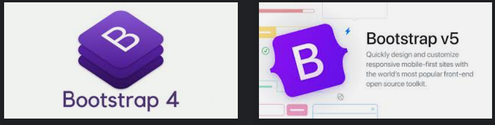
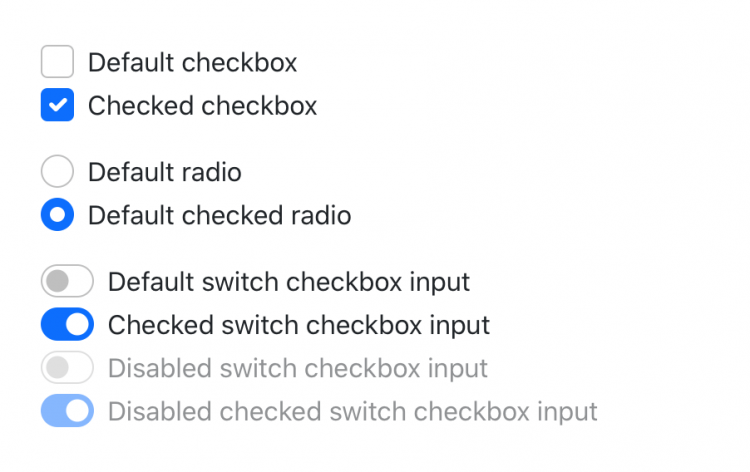

# Session 1- Tổng quan Bootstrap 

> ➡️ 1. Bootstrap là gì?
> 
> ➡️ 2. Điểm nổi bật của Bootstrap
> 
> ➡️ 3. Bootstrap 5 có gì mới?
> 
> ➡️ 4. Tích hợp Bootstrap 5 vào Dự Án
> 
> ➡️ 5. Cấu trúc thư mục Bootstrap 5
> 
> ➡️ 6. Hỗ trợ trình duyệt trong Bootstrap 5
> 
> ➡️ 7. Khái niệm Bootstrap Templates
> 


Tài liệu chính thức: <https://getbootstrap.com/docs/5.3/getting-started/introduction/>

## ⭐ 1. Bootstrap là gì?

**Bootstrap** là một framework mã nguồn mở hoàn toàn miễn phí được phát triển dựa trên các ngôn ngữ: HTML, CSS và Javascript. Với Bootstrap, bạn hoàn toàn có thể phát triển một website với mức độ responsive cao trên nhiều thiết bị khác nhau.

Qua 1 thập kỷ phát triển, phiên bản chính thức mới nhất của Bootstrap tại 1/1/2023 là Bootstrap 5.3. Từ logo, bộ tài liệu hướng dẫn cho đến những nâng cấp khác khiến Bootstrap 5 trở thành một trong những dấu mốc đặc biệt trong lịch sử phát triển của Bootstrap.

😊 Nói một cách đơn giản, Bootstrap là một bộ sưu tập các đoạn code lớn có thể tái sử dụng, được viết bằng HTML, CSS và JavaScript. Bên cạnh đó, đây cũng là framework develop front-end cho phép các developer và designer có thể nhanh chóng xây dựng các trang web responsive. Về cơ bản, framework Bootstrap giúp tiết kiệm thời gian viết CSS, từ đó ta sẽ có nhiều thời gian cho việc thiết kế các trang web hơn. Và hơn hết, nó “HOÀN TOÀN MIỄN PHÍ“.

> **`Bootstrap`** `ví như một bữa tiệc Css Buffet, bạn chỉ việc sử dụng những gì được tạo sẵn.`

**Lịch sử về Bootstrap**

Bootstrap là sản phẩm của **Mark Otto** và **Jacob Thornton** tại Twitter. Tên gọi ban đầu của Bootstrap là **Twitter Blueprint**. Mục đích lúc đầu của nó như một mã nguồn mở vào ngày 19/09/2011 trên GitHub dùng để cải thiện tính nhất quán giữa các công cụ nội bộ.

|Phiên bản|Ngày phát hành|Các thay đổi và nội dung chính|
|:----|:----|:----|
|2.0|31/01/2012|Bổ sung hệ thống Grid-Layout 12 cột. Thêm một số thành phần (component) mới, cũng như thay đổi một vài thành phần sẵn có. Vẫn chưa hỗ trợ Mobile.|
|3.0|19/08/2013|Các thành phần được thiết kế lại theo phong cách thiết kế phẳng (flat design). **Cột mốc quan trọng khi Bootstrap hỗ trợ các thiết bị Mobile.**|
|4.0|19/01/2018|Bootstrap 4 gần như viết lại hoàn toàn từ Bootstrap 3. Phiên bản này được đánh giá là dễ sử dụng hơn rất nhiều so với phiên bản trước.|
|5.0|05/05/2021|Có thêm thành phần off canvas menu và loại bỏ sự phụ thuộc vào jQuery. Thay vào đó, họ chuyển sang [JavaScript Vanilla](https://wiki.tino.org/vanilla-javascript-la-gi/)|

=================================================

## ⭐ 2. Điểm nổi bật của Bootstrap


=================================================
## ⭐ 3. Bootstrap 5 có gì mới?

### 3.1 Logo mới

Có thể bạn chưa biết, logo mới của Bootstrap – Bootstrap 5 có sự thay đổi từ hình vuông thành cặp dấu ngoặc nhọn đặc trưng của CSS đấy! Đây chỉ là một thay đổi nhỏ nhưng vẫn không thay đổi các giá trị ban đầu Bootstrap đặt ra là miễn phí, mã nguồn mở.




### 3.2 Document mới


Nếu trước đây đã từng có thời gian dài theo dõi bộ tài liệu hướng dẫn của Bootstrap, bạn sẽ khá bất ngờ với sự sắp xếp lại toàn bộ tài liệu với nội dung được cập nhật mới và cấu trúc rõ ràng hơn.

Old: <https://getbootstrap.com/docs/3.4/css/>

New Bootstrap 5: <https://getbootstrap.com/docs/5.3/getting-started/introduction/>

### 3.3 Nói không với jQuery

Bạn biết đấy, với Bootstrap 5, Bootstrap team đã quyết định loại bỏ hoàn toàn jQuery ra khỏi code của mình! Với sự thay đổi lớn này, dung lượng code sẽ giảm xuống tối ưu hơn, tốc độ website cũng sẽ được cải thiện nhiều hơn.

Với JavaScript Vanilla (JavaScript thuần) làm chủ đạo, chất lượng code của Bootstrap 5 được cải thiện đáng kể so với người tiền nhiệm Bootstrap 4.

Điều này cũng dẫn đến việc: Toggle Button sẽ được thay bằng Checkbox và Radio button.



### 3.4 API được cập nhật toàn diện

Một trong những điểm rất đáng lưu ý khác của Bootstrap 5 chính là toàn bộ những utility API đã được cải thiện đáng kể như:

- Hệ thống grid đã nâng cấp và cải thiện có thể trông thấy
- Tăng thêm một tầng xxl mới cho grid.
- Toàn bộ tùy chọn Layout đã bị thay thế bằng hệ thống grid mới
- Bổ sung thêm những class mới cho khoảng cách theo hướng dọc
- Thêm giá trị position và giá trị relative không còn mặc định ở cột nữa.

Ngoài ra, chúng ta có thêm một vài utility mới như:

- Đổi tên **font-weight** thành **fw**

- Chuyển .rounded-1, .rounded-2 và .rounded-3 cho các kích cỡ: small, medium và large của border-radius
- Thêm .overflow-visible và .overflow-scroll

### 3.5 Cải thiện tùy biến CSS

Một bước đi “ấn tượng” khác của Bootstrap 5 chính là đội ngũ phát triển đã mạnh dạn “nghỉ chơi” với Internet Explorer. Một ví dụ cụ thể chính là **component .table** với những biến cục bộ để bạn có thể thiết kế một cách dễ dàng hơn:

```css
.table {
--bs-table-bg: #{$table-bg};
--bs-table-accent-bg: transparent;
--bs-table-striped-color: #{$table-striped-color};
--bs-table-striped-bg: #{$table-striped-bg};
--bs-table-active-color: #{$table-active-color};
--bs-table-active-bg: #{$table-active-bg};
--bs-table-hover-color: #{$table-hover-color};
--bs-table-hover-bg: #{$table-hover-bg};
// Styles here...
}
```

Ngoài ra, bản màu đã được mở rộng thêm với rất nhiều mới với độ tương phản màu được cải thiện rất nhiều và tích hợp sẵn trong Bootstrap 5 đấy! Với khả năng tùy chỉnh cao, Bootstrap 5 sẽ trở nên dễ dàng tiếp cận hơn đối với những bạn lần đầu sử dụng.


=================================================

## ⭐ 4. Tích hợp Bootstrap 5 vào Dự Án

Tùy vào mã nguồn dự án, sẽ có cách cài đặt tích hợp khác nhau. Trong phạm vi khóa học Html, Css này thì chỉ cần quan tâm đến 2 cách:


Xem chi tiết: <https://getbootstrap.com/docs/5.3/getting-started/download/>

### Cách 1: Tải Compiled CSS and JS

- Tải Bootstrap 5 về và đặt chung trong dự án của bạn.
- Tích hợp vào Bootstrap 5 vào dự án

### Cách 2: CDN Links

Dán vào head global của dự án

```html
<script src="https://cdn.jsdelivr.net/npm/@popperjs/core@2.11.6/dist/umd/popper.min.js" integrity="sha384-oBqDVmMz9ATKxIep9tiCxS/Z9fNfEXiDAYTujMAeBAsjFuCZSmKbSSUnQlmh/jp3" crossorigin="anonymous"></script>
<script src="https://cdn.jsdelivr.net/npm/bootstrap@5.3.0-alpha1/dist/js/bootstrap.min.js" integrity="sha384-mQ93GR66B00ZXjt0YO5KlohRA5SY2XofN4zfuZxLkoj1gXtW8ANNCe9d5Y3eG5eD" crossorigin="anonymous"></script>

```


=================================================

## ⭐ 5. Cấu trúc thư mục Bootstrap 5

Chi tiết xem: <https://getbootstrap.com/docs/5.3/getting-started/contents/>


=================================================

## ⭐ 6. Hỗ trợ trình duyệt

Chi tiết: <https://getbootstrap.com/docs/5.3/getting-started/browsers-devices/>


=================================================
## ⭐ 7.  Bootstrap Templates

- Demo Bootstrap Templates
- Tạo sao dùng Bootstrap Templates ?

Templates Free: 

- <https://adminlte.io/blog/bootstrap-5-templates/>