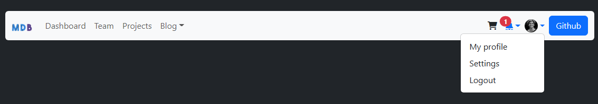

# Homeworks Session 2

## Task 1:

-  Tạo một navbar như hình demo
- Gợi ý: Dùng components: navbar, dropdown, badges, font awesome 

Link Logo: https://mdbcdn.b-cdn.net/img/logo/mdb-transaprent-noshadows.webp

Link Avatar: https://mdbcdn.b-cdn.net/img/new/avatars/2.webp

## Task 2:

- Làm một IU Header có thanh Navbar như Demo sau sử dụng Bootstrap 5.3
- Link Demo: <https://preview.colorlib.com/theme/bootstrap/website-menu-09/>
- Hình nền: https://preview.colorlib.com/theme/bootstrap/website-menu-09/images/hero_1.jpg
